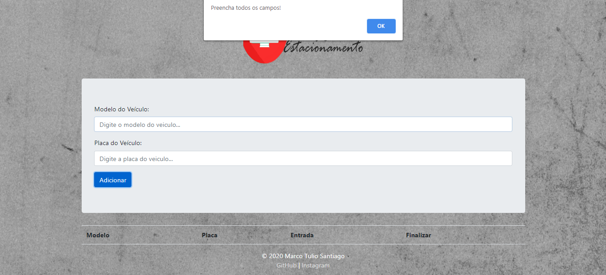

<h1 align="center">
  

</h1>

<h4 align="center">
  ☕ Café e códico ☕
</h4>

<h2 align="center" style="font-family: 'Times New Roman', Times, serif;">
  Tela do Sistema para Estacionamentos
</h2>

  
  
  
 
 
<h1 align="center">
     
  </h1>

## Licença

Esse projeto está sob a licença MIT. Veja o arquivo [LICENSE](LICENSE.md) para mais detalhes.

<h4 align="center"> <em>&lt;/&gt;</em> by <a href="https://github.com/santiagoidu" target="_blank">SantiagoIDU!</a>
</h4>
